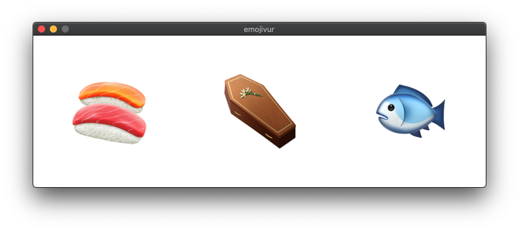

# emojivur

 



### _Lightweight emoji viewer and PDF conversion utility_

Pronounced **uh·mow·jee·vyoo·ur**, `emojivur` is a tool to view how emoji render on the screen _(or in a PDF document)_ with the capability of choosing the emoji font to use and the final size of the rendered glyphs.

---

## Usage
```
Usage: emojivur [OPTION]...
Lightweight emoji viewer and PDF conversion utility.

  -h, --help             Print help and exit
  -V, --version          Print version and exit
  -f, --font=FILENAME    Font file used for rendering
  -o, --output=FILENAME  PDF file to export result to
  -s, --pxsize=INT       Size in pixels to use to render the emojis
                           (default='64')
  -t, --text=STRING      Text to display
```

To get a result similar to the one shown by the screenshot above, on a computer running **macOS** run the folloing command in the **Terminal.app** from the directory where the `emojivur` executable is stored _(after you [build it](#How-to-Build) )_ or installed using the [latest release pre-built version](https://github.com/itnok/emojivur/releases) available:

```bash
$ emojivur -f "/System/Library/Fonts/Apple Color Emoji.ttc" -t "🍣 ⚰️ 🐟" -s 128
```

## :pushpin: Requirements

**:apple: macOS** _(10.15 Catalina)_

_(development)_
- gengetopt _(v2.23)_
- pkg-config _(v0.29.2)_

_(dependencies)_
- cairo _(v1.16.0)_
- harfbuzz _(v2.6.6)_
- freetype _(v2.10.1)_
- sdl2 _(v2.0.12)_
- sdl2_image _(v2.0.5)_


## :hammer: How to Build

### :apple: macOS

Make sure [Homebrew](https://brew.sh/) is installed as it greatly simplifies the build process providing all libraries and dependencies with a negligeable effort. More information is available on the [Homebrew webiste](https://brew.sh/), but for sake of simplicity this is the command to run in the **Terminal.app**:

```bash
$ /bin/bash -c "$(curl -fsSL https://raw.githubusercontent.com/Homebrew/install/master/install.sh)"
```

Installing all the dependencies and needed libraries from source is eventually possibile but not covered in this document. To install the dependencies using `brew` run the following commands:

```bash
$ brew update
$ brew install \
    gengetopt \
    pkg-config \
    cairo \
    harfbuzz \
    freetype \
    sdl2 \
    sdl2_image
```

After having cloned this repository to your computer the program can be built following these steps:

```bash
$ cd /path/to/emojivur
$ mkdir -p build
$ cd build
$ cmake ..
```

At the end of the build process the executable will be in the `/path/to/emojivur/build/bin/` directory.

### :penguin: Linux

**Debian/Raspbian/Ubuntu:**
Installing all the dependencies and needed libraries is very easy leveraging the `apt` package manager. To install the dependencies using `apt` run the following commands:

```bash
$ sudo apt update
$ sudo apt install --no-install-recommends \
    build-essential \
    gengetopt \
    pkg-config \
    libcairo2-dev \
    libharfbuzz-dev \
    libfreetype6-dev \
    libsdl2-dev \
    libsdl2-image-dev
```

After having cloned this repository to your computer the program can be built following these steps:

```bash
$ cd /path/to/emojivur
$ mkdir -p build
$ cd build
$ cmake ..
```

At the end of the build process the executable will be in the `/path/to/emojivur/build/bin/` directory.


## :scroll: License

This software is released under the [MIT License](LICENSE).
